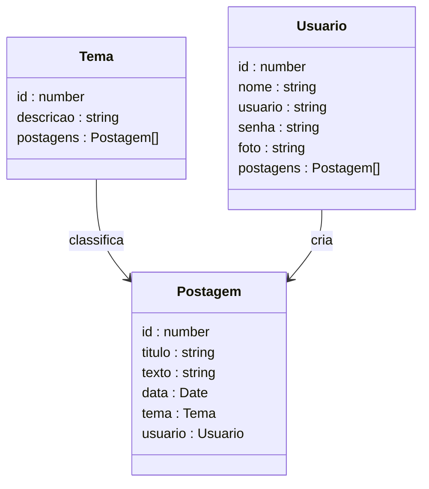
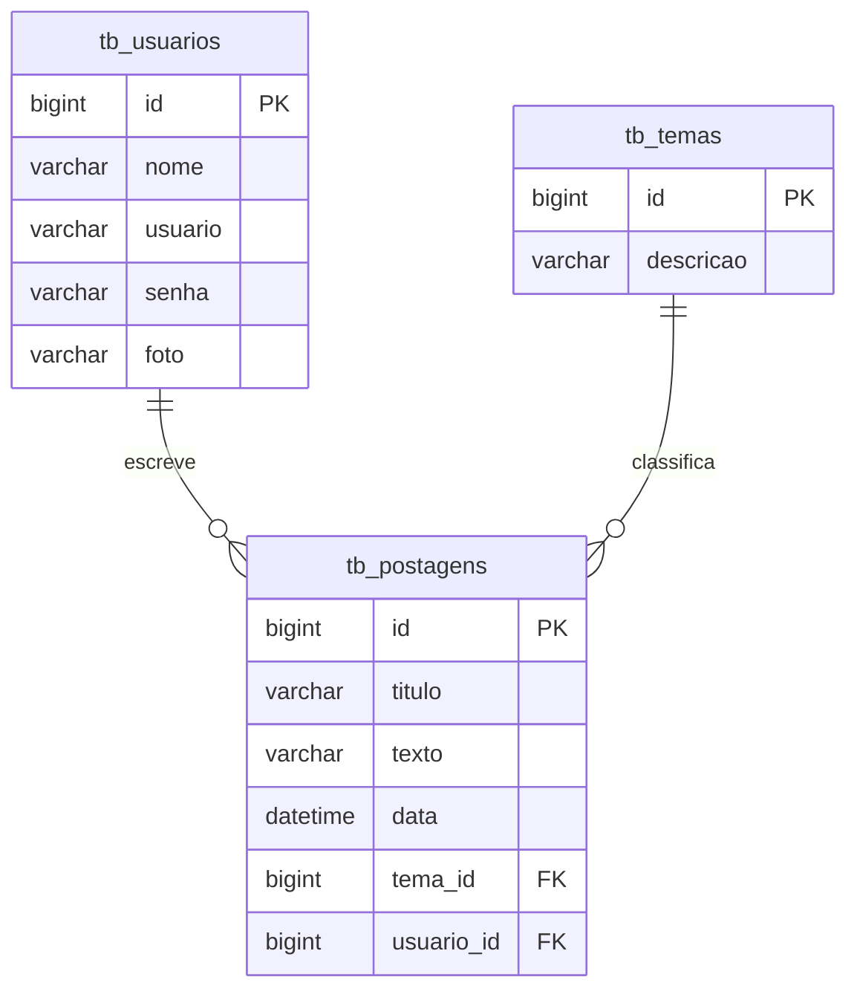

Virtuoso
virtuoso.og
•
❤️Trabalhando a vida enquanto ela me espera..
Canal focado em expressar e tirar dúvidas sobre os conteúdos de Nest

Rafael Queiróz — 27/02/2026 08:07
@Participantes Bom dia Turma JS13!

Seguem os conteúdos sobre Introdução ao Nest, que utilizaremos no período da tarde (sexta-feira 27/02/2026):

Introdução ao Protocolo HTTP:

https://github.com/conteudoGeneration/cookbook_javascript/blob/main/02_http/01.md

Ferramentas do Desenvolvedor:

https://github.com/conteudoGeneration/cookbook_git/blob/main/windows/redes/03_ferramentas_dev.md

Introdução ao Nest JS:

https://github.com/conteudoGeneration/cookbook_javascript/blob/main/04_nest/01.md
https://github.com/conteudoGeneration/cookbook_javascript/blob/main/04_nest/02.md
GitHub
cookbook_javascript/02_http/01.md at main · conteudoGeneration/coo...
Contribute to conteudoGeneration/cookbook_javascript development by creating an account on GitHub.
Contribute to conteudoGeneration/cookbook_javascript development by creating an account on GitHub.
GitHub
cookbook_git/windows/redes/03_ferramentas_dev.md at main · conteud...
Contribute to conteudoGeneration/cookbook_git development by creating an account on GitHub.
cookbook_git/windows/redes/03_ferramentas_dev.md at main · conteud...
GitHub
cookbook_javascript/04_nest/01.md at main · conteudoGeneration/coo...
Contribute to conteudoGeneration/cookbook_javascript development by creating an account on GitHub.
Contribute to conteudoGeneration/cookbook_javascript development by creating an account on GitHub.
GitHub
cookbook_javascript/04_nest/02.md at main · conteudoGeneration/coo...
Contribute to conteudoGeneration/cookbook_javascript development by creating an account on GitHub.
Contribute to conteudoGeneration/cookbook_javascript development by creating an account on GitHub.
Rafael Queiróz — 02/03/2026 07:46
@Participantes Bom dia Turma JS13!

Seguem os conteúdos sobre Nest, que utilizaremos na 2ª Live Code (Segunda-Feira - 02/03/2026):

https://github.com/conteudoGeneration/cookbook_javascript/blob/main/04_nest/03.md
https://github.com/conteudoGeneration/cookbook_javascript/blob/main/04_nest/04.md
https://github.com/conteudoGeneration/cookbook_javascript/blob/main/04_nest/05.md
https://github.com/conteudoGeneration/cookbook_javascript/blob/main/04_nest/06.md
https://github.com/conteudoGeneration/cookbook_javascript/blob/main/04_nest/07.md
GitHub
cookbook_javascript/04_nest/03.md at main · conteudoGeneration/coo...
Contribute to conteudoGeneration/cookbook_javascript development by creating an account on GitHub.
GitHub
cookbook_javascript/04_nest/04.md at main · conteudoGeneration/coo...
Contribute to conteudoGeneration/cookbook_javascript development by creating an account on GitHub.
Contribute to conteudoGeneration/cookbook_javascript development by creating an account on GitHub.
GitHub
cookbook_javascript/04_nest/05.md at main · conteudoGeneration/coo...
Contribute to conteudoGeneration/cookbook_javascript development by creating an account on GitHub.
GitHub
cookbook_javascript/04_nest/06.md at main · conteudoGeneration/coo...
Contribute to conteudoGeneration/cookbook_javascript development by creating an account on GitHub.
Contribute to conteudoGeneration/cookbook_javascript development by creating an account on GitHub.
GitHub
cookbook_javascript/04_nest/07.md at main · conteudoGeneration/coo...
Contribute to conteudoGeneration/cookbook_javascript development by creating an account on GitHub.
Contribute to conteudoGeneration/cookbook_javascript development by creating an account on GitHub.
Rafael Queiróz — 02/03/2026 15:31
@Participantes Segue o Repositório do projeto Blog Pessoal e um modelo de README:

Repositório: https://github.com/rafaelq80/blogpessoal_nest_tjs13 
# Projeto Blog Pessoal — Backend com NestJS

<br />

<div align="center">
     

modelo_readme_blog_nest.md
10 KB
GitHub
GitHub - rafaelq80/blogpessoal_nest_tjs13: O Projeto Blog Pessoal ...
O Projeto Blog Pessoal é uma API REST desenvolvida com NestJS e TypeScript, projetada para gerenciar de forma eficiente os recursos de um blog. - rafaelq80/blogpessoal_nest_tjs13
GitHub - rafaelq80/blogpessoal_nest_tjs13: O Projeto Blog Pessoal ...
Rafael Queiróz — 03/03/2026 08:06
@Participantes Bom dia Turma JS13!

Seguem os conteúdos sobre Nest, que utilizaremos 3ª Live Code (Terça-Feira - 03/03/2026)

https://github.com/conteudoGeneration/cookbook_javascript/blob/main/04_nest/08.md
https://github.com/conteudoGeneration/cookbook_javascript/blob/main/04_nest/09.md
https://github.com/conteudoGeneration/cookbook_javascript/blob/main/04_nest/10.md
https://github.com/conteudoGeneration/cookbook_javascript/blob/main/04_nest/11.md
https://github.com/conteudoGeneration/cookbook_javascript/blob/main/04_nest/12.md

Biblioteca Class-Transform: https://github.com/rafaelq80/aulas_generation/blob/main/nestjs/nestjs_isnotblank.md
GitHub
cookbook_javascript/04_nest/08.md at main · conteudoGeneration/coo...
Contribute to conteudoGeneration/cookbook_javascript development by creating an account on GitHub.
cookbook_javascript/04_nest/08.md at main · conteudoGeneration/coo...
GitHub
cookbook_javascript/04_nest/09.md at main · conteudoGeneration/coo...
Contribute to conteudoGeneration/cookbook_javascript development by creating an account on GitHub.
Contribute to conteudoGeneration/cookbook_javascript development by creating an account on GitHub.
GitHub
cookbook_javascript/04_nest/10.md at main · conteudoGeneration/coo...
Contribute to conteudoGeneration/cookbook_javascript development by creating an account on GitHub.
cookbook_javascript/04_nest/10.md at main · conteudoGeneration/coo...
GitHub
cookbook_javascript/04_nest/11.md at main · conteudoGeneration/coo...
Contribute to conteudoGeneration/cookbook_javascript development by creating an account on GitHub.
cookbook_javascript/04_nest/11.md at main · conteudoGeneration/coo...
GitHub
cookbook_javascript/04_nest/12.md at main · conteudoGeneration/coo...
Contribute to conteudoGeneration/cookbook_javascript development by creating an account on GitHub.
Contribute to conteudoGeneration/cookbook_javascript development by creating an account on GitHub.
Rafael Queiróz — 04/03/2026 10:23
@Participantes Diagrama de Classes - Recurso Tema
Imagem
Rafael Queiróz — 05/03/2026 07:49
@Participantes Bom dia Turma JS13!

Seguem os conteúdos sobre Nest, que utilizamos na 4ª Live Code (Quarta-Feira - 04/03/2026):

https://github.com/conteudoGeneration/cookbook_javascript/blob/main/04_nest/13.md
https://github.com/conteudoGeneration/cookbook_javascript/blob/main/04_nest/14.md
GitHub
cookbook_javascript/04_nest/13.md at main · conteudoGeneration/coo...
Contribute to conteudoGeneration/cookbook_javascript development by creating an account on GitHub.
Contribute to conteudoGeneration/cookbook_javascript development by creating an account on GitHub.
GitHub
cookbook_javascript/04_nest/14.md at main · conteudoGeneration/coo...
Contribute to conteudoGeneration/cookbook_javascript development by creating an account on GitHub.
Contribute to conteudoGeneration/cookbook_javascript development by creating an account on GitHub.
Rafael Queiróz — 05/03/2026 16:50
@Participantes Imagens - Introdução ao Nest
Imagem
Imagem
Rafael Queiróz — 09/03/2026 07:46
@Participante Bom dia Turma JS13!

Seguem os conteúdos sobre Nest, que utilizaremos na atividade prática (Segunda-Feira - 09/03/2026):

Documentação do TypeORM: https://typeorm.io/find-options

Imagekit.io: https://github.com/rafaelq80/aulas_generation/tree/main/util

Imagens dos jogos: https://drive.google.com/drive/folders/1NT6X6Dx8V90sMcb4oYwGOZzm5bP-WQnm?usp=sharing 

Numeric Transformer: https://github.com/rafaelq80/aulas_generation/blob/main/nestjs/numeric_transformer.md 
GitHub
aulas_generation/util at main · rafaelq80/aulas_generation
Contribute to rafaelq80/aulas_generation development by creating an account on GitHub.
Contribute to rafaelq80/aulas_generation development by creating an account on GitHub.
Google Drive
GitHub
aulas_generation/nestjs/numeric_transformer.md at main · rafaelq80...
Contribute to rafaelq80/aulas_generation development by creating an account on GitHub.
Contribute to rafaelq80/aulas_generation development by creating an account on GitHub.
Rafael Queiróz — 10/03/2026 07:57
@Participantes  Bom dia Turma JavaScript 13!

Seguem os conteúdos sobre Security, que utilizaremos na 5ª Live Code (Terça-Feira - 10/03/2026):

https://github.com/conteudoGeneration/cookbook_javascript/blob/main/04_nest/15.md
https://github.com/conteudoGeneration/cookbook_javascript/blob/main/04_nest/16.md
https://github.com/conteudoGeneration/cookbook_javascript/blob/main/04_nest/17.md
https://github.com/conteudoGeneration/cookbook_javascript/blob/main/04_nest/18.md
https://github.com/conteudoGeneration/cookbook_javascript/blob/main/04_nest/19.md
https://github.com/conteudoGeneration/cookbook_javascript/blob/main/04_nest/20.md

Imagens - Usuários: https://drive.google.com/drive/folders/17f9ZgqZpFmrZj0Aqr6JYG9_dPh0h2dS4?usp=drive_link
GitHub
cookbook_javascript/04_nest/15.md at main · conteudoGeneration/coo...
Contribute to conteudoGeneration/cookbook_javascript development by creating an account on GitHub.
cookbook_javascript/04_nest/15.md at main · conteudoGeneration/coo...
GitHub
cookbook_javascript/04_nest/16.md at main · conteudoGeneration/coo...
Contribute to conteudoGeneration/cookbook_javascript development by creating an account on GitHub.
cookbook_javascript/04_nest/16.md at main · conteudoGeneration/coo...
GitHub
cookbook_javascript/04_nest/17.md at main · conteudoGeneration/coo...
Contribute to conteudoGeneration/cookbook_javascript development by creating an account on GitHub.
cookbook_javascript/04_nest/17.md at main · conteudoGeneration/coo...
GitHub
cookbook_javascript/04_nest/18.md at main · conteudoGeneration/coo...
Contribute to conteudoGeneration/cookbook_javascript development by creating an account on GitHub.
cookbook_javascript/04_nest/18.md at main · conteudoGeneration/coo...
GitHub
cookbook_javascript/04_nest/19.md at main · conteudoGeneration/coo...
Contribute to conteudoGeneration/cookbook_javascript development by creating an account on GitHub.
cookbook_javascript/04_nest/19.md at main · conteudoGeneration/coo...
Rafael Queiróz — 11/03/2026 15:25
@Participantes  Bom dia Turma JS13!

Dia de Revisão de Security!

Implemente a Security no Projeto Loja de Games em uma nova Branch. A Classe Produto não tem Relacionamento com a Classe Usuario.

Desafio:  Adicione a validação da idade do usuário a partir da data de nascimento, verificando antes do cadastro, se o usuário é maior de idade.

Dica: Utilize a Biblioteca date-fns para resolver o desafio. 
Rafael Queiróz — 07:52
@Participantes Bom dia Turma JavaScript 13!

Seguem os conteúdos sobre Teste de Software, que utilizaremos na 6ª Live Code (Segunda-Feira - 16/03/2026):

https://github.com/conteudoGeneration/cookbook_javascript/blob/main/04_nest/21.md
https://github.com/conteudoGeneration/cookbook_javascript/blob/main/04_nest/22.md
https://github.com/conteudoGeneration/cookbook_javascript/blob/main/04_nest/23.md
GitHub
cookbook_javascript/04_nest/21.md at main · conteudoGeneration/coo...
Contribute to conteudoGeneration/cookbook_javascript development by creating an account on GitHub.
Contribute to conteudoGeneration/cookbook_javascript development by creating an account on GitHub.
GitHub
cookbook_javascript/04_nest/22.md at main · conteudoGeneration/coo...
Contribute to conteudoGeneration/cookbook_javascript development by creating an account on GitHub.
Contribute to conteudoGeneration/cookbook_javascript development by creating an account on GitHub.
GitHub
cookbook_javascript/04_nest/23.md at main · conteudoGeneration/coo...
Contribute to conteudoGeneration/cookbook_javascript development by creating an account on GitHub.
Contribute to conteudoGeneration/cookbook_javascript development by creating an account on GitHub.
@Participante Bom dia Turma JavaScript 06!

Seguem os conteúdos sobre Documentação da API com o Swagger e Deploy no Render, que serão utilizados no período da manhã (Segunda-Feira - 27/01/2025):

Documentação: https://github.com/conteudoGeneration/cookbook_javascript/blob/main/04_nest/24.md

Deploy: 
https://github.com/rafaelq80/aulas_generation/blob/main/nestjs/deploy_neon.md

Guia de Facilidades do Insomnia: https://github.com/rafaelq80/aulas_generation/blob/main/nestjs/guia_insomnia.md

Checklist - Blog Pessoal: https://drive.google.com/file/d/1Uwzv8mqk7xg-DZSd6sEq_H2SLblzaPgK/view?usp=sharing

Quando forem entregar a atividade no Canvas, não esqueçam de encaminhar o Link do Github e o Link do Deploy no Render. Para ajudar no processo de finalização do Blog, eu compartilhei o Checklist do Blog Pessoal, contendo todos os itens esperados no Projeto Blog Pessoal.

IMPORTANTE: O Deploy no Render deve estar com o Blog Pessoal completo, funcional, incluindo a Security, como mostra o checklist do Blog Pessoal. Para facilitar o processo do deploy e da correção, mantenham o blog na branch main.
GitHub
cookbook_javascript/04_nest/24.md at main · conteudoGeneration/coo...
Contribute to conteudoGeneration/cookbook_javascript development by creating an account on GitHub.
Contribute to conteudoGeneration/cookbook_javascript development by creating an account on GitHub.
GitHub
aulas_generation/nestjs/deploy_neon.md at main · rafaelq80/aulas_g...
Contribute to rafaelq80/aulas_generation development by creating an account on GitHub.
aulas_generation/nestjs/deploy_neon.md at main · rafaelq80/aulas_g...
GitHub
aulas_generation/nestjs/guia_insomnia.md at main · rafaelq80/aulas...
Contribute to rafaelq80/aulas_generation development by creating an account on GitHub.
Contribute to rafaelq80/aulas_generation development by creating an account on GitHub.
Google Docs
checklist_blog_pessoal_nest.pdf
Rafael Queiróz — 14:26
@Participante Boa tarde Turma JavaScript 06!

Exercício de Revisão!

Segue o Guia do Exercício de Revisão no Notion: https://rafaelq80.notion.site/Revis-o-do-Bloco-2-Projeto-Brech-5ebc49c2ff544a32bbee3ff0e8395a74

 IMPORTANTE! 

Este exercício de revisão não é obrigatório e não será solicitada a entrega no Canvas ou no Discord. É um exercício opcional, que vocês podem utilizar para revisar os conteúdos e se preparar para o Performance Goal. 

Na Terça Feira (17/03/2025), utilizaremos este exercício na sessão de revisão do conteúdo, antes do Performance Goal.
rafaelq80 on Notion
Revisão do Bloco 2: Projeto Brechó | Notion
✔Criar o Projeto
Revisão do Bloco 2: Projeto Brechó | Notion
Rafael Queiróz — 16:09
@Participantes Boa tarde Turma JS13!

Segue o repositório da Loja de Games com a Security os testes E2E dos 3 Recursos.

Repositório: https://github.com/rafaelq80/lojagames_nest_tjs13

Na Security, foi utilizada a Biblioteca date-fns para Calcular a idade, como mostra o link abaixo:

Cálculo da idade: https://github.com/rafaelq80/aulas_generation/blob/main/nestjs/nestjs_usuario_maior.md

Nos testes, observem que a Configuração do Banco de dados, do ambiente de testes e da geração do token estão na Classe TestService, dentro do recurso data. 

Nas 3 Classes de teste, localizadas na pasta test, estão apenas os testes propriamente ditos. 

Desta forma, os códigos foram refatorados para não repetir código nas 3 Classes de Teste.
GitHub
GitHub - rafaelq80/lojagames_nest_tjs13: O Projeto Loja de Games é...
O Projeto Loja de Games é uma API REST desenvolvida para gerenciar um sistema de e-commerce de Games. - rafaelq80/lojagames_nest_tjs13
GitHub - rafaelq80/lojagames_nest_tjs13: O Projeto Loja de Games é...
GitHub
aulas_generation/nestjs/nestjs_usuario_maior.md at main · rafaelq8...
Contribute to rafaelq80/aulas_generation development by creating an account on GitHub.
aulas_generation/nestjs/nestjs_usuario_maior.md at main · rafaelq8...
@Participantes Imagens sobre Security
Imagem
Imagem

# Projeto Blog Pessoal — Backend com NestJS

<br />

<div align="center">
     
</div>


<br />

<div align="center">
  
  
  
  
  
  
  

</div>

<br />

## Descrição


O **Blog Pessoal** é uma API backend que permite que usuários publiquem, editem e visualizem postagens relacionadas a diferentes temas de forma organizada e segura.

O projeto foi desenvolvido com fins educacionais, simulando uma aplicação real utilizada em ambientes profissionais, com foco na construção de **APIs REST escaláveis utilizando NestJS e TypeScript**.

Entre os principais recursos disponíveis:

1. Criação, edição e exclusão de postagens
2. Associação de postagens a temas específicos
3. Cadastro e autenticação de usuários
4. Consulta de postagens por tema ou usuário
5. Controle de acesso em operações protegidas

------

## Sobre esta API


A API foi desenvolvida utilizando **Node.js**, **NestJS** e **TypeScript**, seguindo princípios de:

- Arquitetura modular
- Separação de responsabilidades
- Padrão REST
- Boas práticas de organização de código backend

A aplicação disponibiliza endpoints para gerenciamento dos recursos:

- **Usuário**
- **Postagem**
- **Tema**

permitindo a interação entre usuários e conteúdos publicados.

------

### Principais funcionalidades da API


1. Cadastro, autenticação e atualização de usuários
2. Gerenciamento de temas para classificação das postagens
3. Criação, edição, listagem e exclusão de postagens
4. Relacionamento entre postagens, autores e temas
5. Autenticação baseada em **JWT** para proteção das rotas

------

## Diagrama de Classes


O diagrama abaixo representa a estrutura lógica das entidades da aplicação e seus relacionamentos dentro da API.



------

## Diagrama Entidade-Relacionamento (DER)


O DER representa como os dados estão organizados no banco relacional e como as entidades se relacionam.



------

## Tecnologias Utilizadas


| Item               | Descrição                         |
| ------------------ | --------------------------------- |
| **Runtime**        | Node.js                           |
| **Linguagem**      | TypeScript                        |
| **Framework**      | NestJS                            |
| **Arquitetura**    | Modular + REST                    |
| **ORM**            | TypeORM                           |
| **Banco de Dados** | MySQL                             |
| **Autenticação**   | Passport                          |
| **Validação**      | class-validator + class-transform |
| **Documentação**   | Swagger (OpenAPI)                 |
| **Testes**         | Jest + Super Test                 |

------

## Arquitetura do Projeto


O projeto foi desenvolvido utilizando a arquitetura modular proposta pelo **NestJS**, promovendo organização, escalabilidade e facilidade de manutenção do código.

Cada domínio da aplicação é isolado em um módulo próprio, contendo suas responsabilidades bem definidas:

* **Controller** → recebe e trata requisições HTTP
* **Service** → contém as regras de negócio
* **Entity** → representa as tabelas do banco de dados
* **Repository/ORM** → comunicação com o banco (via TypeORM)

Essa separação facilita testes, evolução do sistema e reutilização de código.

---

## Estrutura de Pastas


A organização segue o padrão recomendado pelo NestJS:

```bash
📦src
 ┣ 📂auth
 ┣ 📂data
 ┣ 📂postagem
 ┣ 📂tema
 ┣ 📂usuario
 ┣ 📂util
 ┣ 📜app.controller.ts
 ┣ 📜app.module.ts
 ┣ 📜app.service.ts
 ┗ 📜main.ts
```

### Organização por módulo

Exemplo:

```bash
📦usuario
 ┣ 📂controllers
 ┃ ┗ 📜usuario.controller.ts
 ┣ 📂entities
 ┃ ┗ 📜usuario.entity.ts
 ┣ 📂services
 ┃ ┗ 📜usuario.service.ts
 ┗ 📜usuario.module.ts
```

Esse padrão permite crescimento do sistema sem acoplamento excessivo entre funcionalidades.

---

## Fluxo de Autenticação (JWT)


A autenticação da API utiliza **JSON Web Token (JWT)** para proteger rotas sensíveis.

### Fluxo geral:

1. O usuário realiza login informando credenciais
2. A API valida os dados
3. Um token JWT é gerado
4. O cliente envia o token no header das próximas requisições:

```http
Authorization: Bearer TOKEN
```

5. Os Guards do NestJS validam o token antes de permitir acesso às rotas protegidas.

Esse modelo é amplamente utilizado em aplicações modernas por ser:

* Stateless
* Escalável
* Compatível com APIs REST

---

## Validação de Dados


A aplicação utiliza:

* `class-validator`
* `class-transformer`

para garantir integridade dos dados recebidos pela API.

Exemplo conceitual:

* Campos obrigatórios são verificados automaticamente
* Tipos inválidos são rejeitados antes da regra de negócio
* Respostas de erro seguem padrão HTTP

Isso reduz erros e aumenta a confiabilidade da API.

---

## Boas Práticas Aplicadas


Durante o desenvolvimento foram aplicados conceitos utilizados em projetos reais:

* Organização modular do NestJS
* Separação entre controller e regras de negócio
* Tipagem forte com TypeScript
* Padronização REST
* Autenticação baseada em token
* Estrutura preparada para escalabilidade

---

## Diferenciais Técnicos


Este projeto demonstra competências importantes para desenvolvimento backend moderno:

✅ Construção de API REST com NestJS
✅ Arquitetura modular escalável
✅ Autenticação JWT
✅ Modelagem relacional (Usuário → Postagem → Tema)
✅ Integração com banco de dados MySQL via ORM
✅ Validação automática de dados
✅ Documentação interativa com Swagger
✅ Uso profissional de TypeScript no backend

---

## Requisitos


Para executar o projeto localmente:

- Node.js 18+
- npm
- MySQL
- Insomnia

------

## Como Executar o Projeto


### Clonando o repositório

```bash
git clone https://github.com/rafaelq80/blogpessoal_nest_tjs13.git
cd blogpessoal_nest_tjs13
```

------

### Instalando as dependências

```bash
npm install
```

------

### Configurando variáveis de ambiente

Crie um arquivo `.env` na raiz do projeto:

```env
DB_HOST=localhost
DB_PORT=3306
DB_USERNAME=root
DB_PASSWORD=root
DB_DATABASE=db_blogpessoal

JWT_SECRET=secret
```

------

### Executando a aplicação

```bash
npm run start:dev
```

A API será iniciada em:

```
http://localhost:4000
```

------

### Documentação da API

Após iniciar o projeto, acesse:

```
http://localhost:4000
```

O Swagger permitirá:

- visualizar endpoints
- testar requisições
- consultar modelos de dados

------

## Executando os Testes


Para rodar os testes automatizados:

```bash
npm run test
```

------

## Implementações Futuras


* Paginação de resultados
* Upload de imagens para usuários e postagens
* Sistema de comentários
* Refresh Token

------

## Contribuição


Sugestões, melhorias e pull requests são bem-vindos.

Você pode contribuir com:

- Melhorias arquiteturais
- Refatorações
- Testes automatizados
- Documentação

------

## Licença


Este projeto está sob licença **MIT** — livre para uso educacional e profissional.

------

## Autor


**Rafael — Desenvolvedor Full Stack & Instrutor**

🔗 **GitHub:** https://github.com/rafaelq80

🔗 **LinkedIn:** https://www.linkedin.com/in/rafaelq80

Projeto desenvolvido para **aprendizado contínuo**, **demonstração técnica** e **portfólio profissional**.
modelo_readme_blog_nest.md
10 KB
